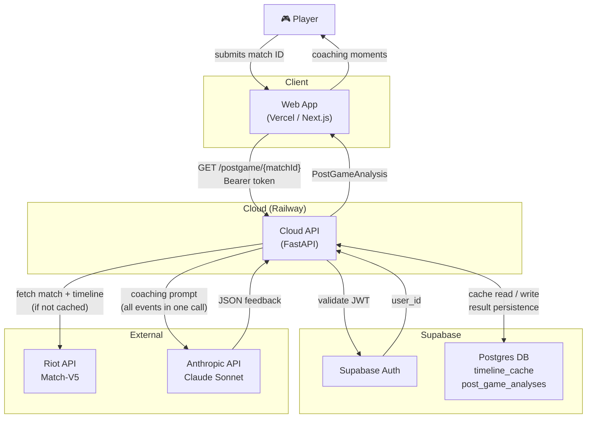
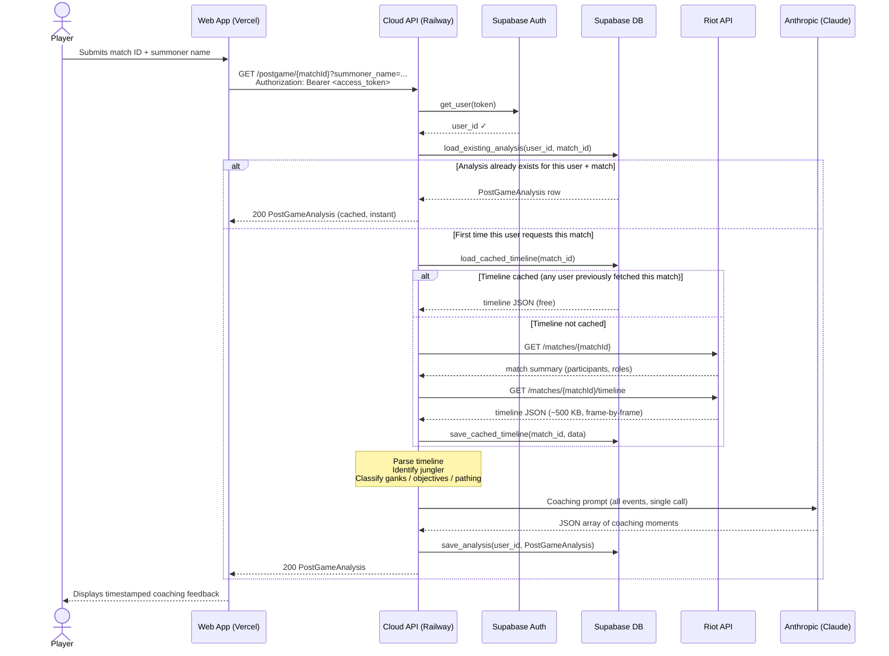

# Post-Game Analysis — Data Flow

How data moves from a completed LoL match to coaching feedback on the web page.

---

## System overview

---

## Request flow (sequence)

---

## What each layer does

| Layer | Tech | Responsibility |
|---|---|---|
| Web app | Next.js on Vercel | UI — match ID input, display coaching moments, match history |
| Cloud API | FastAPI on Railway | Orchestration — auth, caching, Riot API, Claude, persistence |
| Supabase Auth | Supabase | JWT validation — ensures only logged-in users can trigger analysis |
| `timeline_cache` | Supabase Postgres | Shared Riot timeline cache — each match costs 1 Riot API call ever |
| `post_game_analyses` | Supabase Postgres | Per-user analysis history — idempotent, enables match history feature |
| Riot API | Match-V5 | Raw match data — participants, positions, events |
| Anthropic API | Claude Sonnet | Natural language coaching — one call per analysis, all events batched |

---

## What does NOT touch the cloud API

The local desktop backend (`localhost:7429`) handles everything that requires the user's screen:

- Screen capture (mss)
- OCR of the TAB scoreboard (pytesseract)
- Live gank priority suggestions (every ~45s during a game)

These will never move to the cloud — they are inherently local by design.
